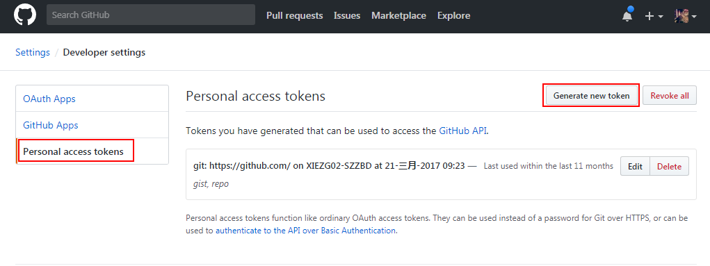
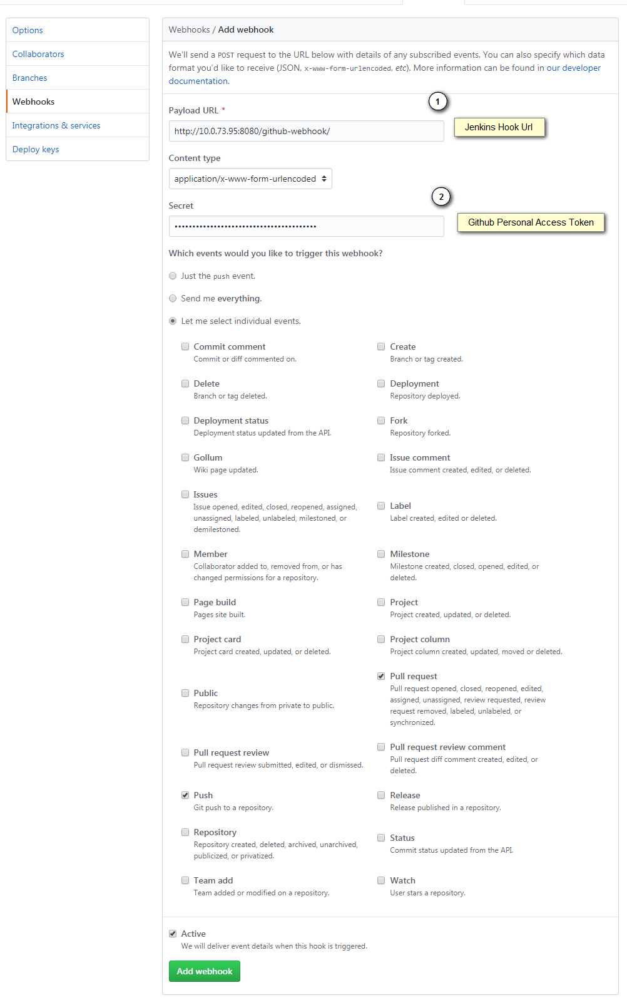
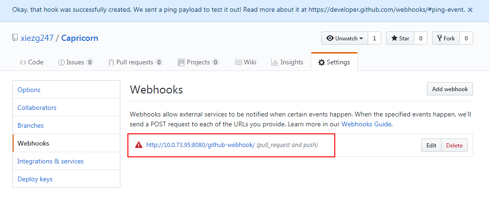

## 一. 背景
自动化部署就是为了解放生产力。

## 二. CI部署
### Jenkins与Github集成

#### Github Hooks
配置Github项目仓库，Github项目仓库在处理这些动作的同时会发送信号至Jenkins触发自动构建操作。

##### 生成Personal Access Token
- 登录[Github](https://github.com)，在头像上点击settings

- 点击Developer settings下的Personal access tokens

- 点击Generate new token,在Token description中填一个描述名称，下面的复选框是这个token需要的权限，按照需要的权限勾上。

- token可复制使用


##### 配置Github项目仓库
上面的Token是属于账户级的东西，Webhooks是项目级别的。当项目发生了某个事件，Github会给一个指定的url发Post请求。
- 点击项目仓库的settings

- 在Webhooks选项卡中，点击Add webhook

- 将在Jenkins生成的Hook URL填入至Payload URL中，选择自主事件,当Github收到了客户端有Push/Pull Request动作时，会触发一个Hook

- 保存WebHook


#### Jenkins安装
- [Installing Jenkins on Ubuntu](https://wiki.jenkins.io/display/JENKINS/Installing+Jenkins+on+Ubuntu)

#### Jenkins全局配置


#### Jenkins项目配置


#### Jenkins执行脚本分析
```bash
#!/usr/bin/env bash

set -e

source /home/xiezhigang/deploy_pluto/bin/activate

./runtest.sh

version=$(date +%Y%m%d_%H%M)
registry=bu6.io
image_name=pluto

docker build -f Dockerfile -t $registry/$image_name:$version .

docker push ${registry}/${image_name}:$version

docker rmi ${registry}/${image_name}:$version

ansible-playbook deploy_prod.yml --extra-vars "version=$version"
```

从执行命令可以知道几点：
- 需要安装了ansible的python虚拟环境
- 需要docker registry镜像服务器
- 需要在项目中写好了dockerfile/deploy_prod.yml配置文件

## 三. 部署脚本

### Ansible
#### Ansible Playbook

### Docker
#### Docker File
#### Docker镜像
#### Docker Registry
#### Docker Compose

## 三. 优化
## 四. 总结

## 五. 参考
- [Jenkins与Github集成](https://www.cnblogs.com/weschen/p/6867885.html)
- [手把手教你搭建Jenkins+Github持续集成环境](https://www.jianshu.com/p/22b7860b4e81)