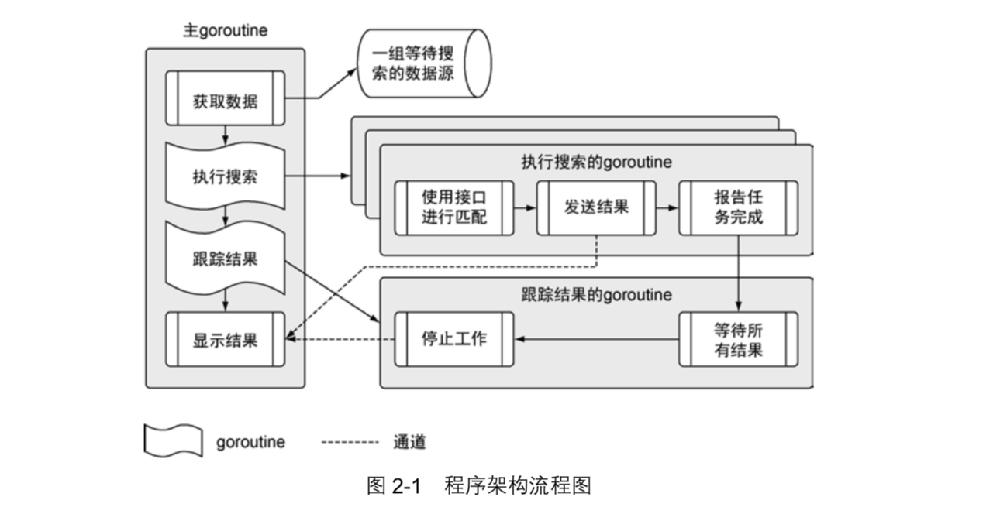

## 快速开始一个Go程序

- 学习如何写一个复杂的Go程序
- 声明类型、变量、函数和方法
- 启动并同步操作goroutine
- 使用接口写通用的代码
- 处理程序逻辑和错误

### 程序架构


### 项目结构
[sample](./sample)

```go
├── README.md
├── data
│   └── data.json          -- 包含一组数据源
├── main
├── main.go                -- 程序的入口
├── matchers
│   └── rss.go             -- 搜索 rss 源的匹配器
└── search
    ├── default.go         -- 搜索数据用的默认匹配器
    ├── feed.go            -- 用于读取 json 数据文件
    ├── match.go           -- 用于支持不同匹配器的接口
    └── search.go          -- 执行搜索的主控制逻辑                
```

### 小结

- 每个代码文件都属于一个包，而包名应该与代码文件所在的文件夹同名
- Go语言提供了多种声明和初始化变量的方式，如果变量的值没有显式初始化，编译器会将变量初始化为零值
- 使用指针可以在函数间或者goroutine间共享数据
- 通过启动goroutine和使用通道完成并发和同步
- Go语言提供了内置函数来支持Go语言内部的数据结构
- 标准库包含很多包，能做很多很有用的事情
- 使用Go接口可以编写通用的代码和框架
