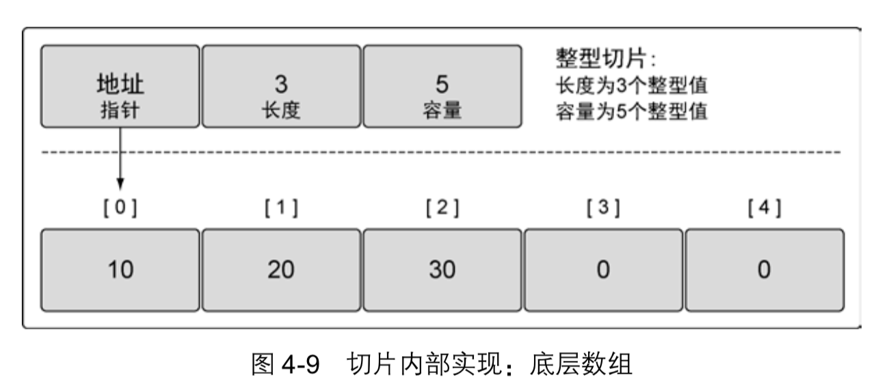

## 数组、切片和映射

- 数组的内部实现和基础功能
- 使用切片管理数据集合
- 使用映射管理键值对

### 数组的内部实现和基础功能

#### 内部实现

- 在 Go 语言里，数组是一个长度固定的数据类型，用于存储一段具有相同的类型的元素的连续块。
- 数组存储的类型可以是内置类型，如整型或者字符串，也可以是某种结构类型。
- 数组占用的内存是连续分配的。

#### 声明和初始化

- 声明数组时需要指定内部存储的数据的类型，以及需要存储的元素的数量，这个数量也称为数组的长度。
- 一旦声明，数组里存储的数据类型和数组长度就都不能改变了。如果需要存储更多的元素，就需要先创建一个更长的数组，再把原来数组里的值复制到新数组里。
- 在 Go 语言中声明变量时，总会使用对应类型的零值来对变量进行初始化。

```go
// 声明一个包含 5 个元素的整型数组
// 用具体值初始化每个元素
array := [5]int{10, 20, 30, 40, 50}

// 声明一个整型数组
// 用具体值初始化每个元素
// 容量由初始化值的数量决定
array := [...]int{10, 20, 30, 40, 50}

// 声明一个有 5 个元素的数组
// 用具体值初始化索引为 1 和 2 的元素 
// 其余元素保持零值
array := [5]int{1: 10, 2: 20}
```
#### 使用数组

因为内存布局是连续的，所以数组是效率很高的数据结构。在访问数组里任意元素的时候，这种高效都是数组的优势。要访问数组里某个单独元素，使用[]运算符。

- 访问数组元素
```go
// 声明一个包含 5 个元素的整型数组
// 用具体值初始为每个元素
array := [5]int{10, 20, 30, 40, 50}
// 修改索引为 2 的元素的值 
array[2] = 35
```

- 访问指针数组的元素
```go
// 声明包含 5 个元素的指向整数的数组
// 用整型指针初始化索引为 0 和 1 的数组元素
array := [5]*int{0: new(int), 1: new(int)}
// 为索引为0和1的元素赋值 
*array[0] = 10 
*array[1] = 20
```

- 把同样类型的一个数组赋值给另外一个数组

```go
// 数组变量的类型包括数组长度和每个元素的类型。
// 只有这两部分都相同的数组，才是类型相同的数组，才能互相赋值

// 声明第一个包含 5 个元素的字符串数组 
var array1 [5]string
// 声明第二个包含 5 个元素的字符串数组
// 用颜色初始化数组
array2 := [5]string{"Red", "Blue", "Green", "Yellow", "Pink"}
// 把 array2 的值复制到 array1
// 复制之后，两个数组的值完全一样
array1 = array2
```

- 编译器会阻止类型不同的数组互相赋值
```go
// 声明第一个包含 4 个元素的字符串数组 
var array1 [4]string
// 声明第二个包含 5 个元素的字符串数组
// 使用颜色初始化数组
array2 := [5]string{"Red", "Blue", "Green", "Yellow", "Pink"}
// 将 array2 复制给 array1 
array1 = array2

Compiler Error:
cannot use array2 (type [5]string) as type [4]string in assignment
```

- 把一个指针数组赋值给另一个
```go
// 复制数组指针，只会复制指针的值，而不会复制指针所指向的值
// 复制之后，两个数组指向同一组字符串

// 声明第一个包含 3 个元素的指向字符串的指针数组 
var array1 [3]*string
// 声明第二个包含 3 个元素的指向字符串的指针数组
// 使用字符串指针初始化这个数组
array2 := [3]*string{new(string), new(string), new(string)}
// 使用颜色为每个元素赋值 
*array2[0] = "Red" 
*array2[1] = "Blue" 
*array2[2] = "Green"
// 将 array2 复制给 array1 
array1 = array2
```

#### 多维数组
数组本身只有一个维度，不过可以组合多个数组创建多维数组。
多维数组很容易管理具有父子关系的数据或者与坐标系相关联的数据。

- 声明二维数组
```go
// 声明一个二维整型数组，两个维度分别存储 4 个元素和 2 个元素
var array [4][2]int
// 使用数组字面量来声明并初始化一个二维整型数组
array := [4][2]int{{10, 11}, {20, 21}, {30, 31}, {40, 41}}
// 声明并初始化外层数组中索引为 1 个和 3 的元素
array := [4][2]int{1: {20, 21}, 3: {40, 41}}
// 声明并初始化外层数组和内层数组的单个元素 
array := [4][2]int{1: {0: 20}, 3: {1: 41}}
```

- 访问二维数组的元素
```go
// 声明一个 2×2 的二维整型数组
var array [2][2]int
// 设置每个元素的整型值 
array[0][0] = 10
 
array[0][1] = 20
array[1][0] = 30
array[1][1] = 40
```

- 使用索引为多维数组赋值
```go
// 将 array1 的索引为 1 的维度复制到一个同类型的新数组里 
var array3 [2]int = array1[1]
// 将外层数组的索引为 1、内层数组的索引为 0 的整型值复制到新的整型变量里 
var value int = array1[1][0]
```

#### 在函数间传递数组
根据内存和性能来看，在函数间传递数组是一个开销很大的操作。在函数之间传递变量时，总是以值的方式传递的。
可以只传入指向数组的指针，这样只需要复制8字节的数据而不是8MB的内存数据到栈上。

- 使用指针在函数间传递大数组
```go
//分配一个需要8 MB的数组
var array [1e6]int
// 将数组的地址传递给函数 
foo foo(&array)
// 函数 foo 接受一个指向 100 万个整型值的数组的指针 
func foo(array *[1e6]int) {
... }
```

### 切片的内部实现和基础功能

#### 内部实现

- 切片是一种数据结构，这种数据结构便于使用和管理数据集合。
- 切片是围绕动态数组的概念构建的，可以按需自动增长和缩小。
- 切片的动态增长是通过内置函数 append 来实现的。
- 这个函数可以快速且高效地增长切片。还可以通过对切片再次切片来缩小一个切片的大小。
- 切片的底层内存也是在连续块中分配的，所以切片还能获得索引、迭代以及为垃圾回收优化的好处。



切片有3个字段的数据结构，这些数据结构包含 Go 语言需要操作底层数组的元数据。
这3个字段分别是指向底层数组的指针、切片访问的元素的个数(即长度)和切片允许增长到的元素个数(即容量)。

#### 创建和初始化

是否能提前知道切片需要的容量通常会决定 要如何创建切片。

##### make 和切片字面量
- 使用长度声明一个字符串切片
```go
// 创建一个字符串切片
// 其长度和容量都是 5 个元素 
slice := make([]string, 5)
```

- 使用长度和容量声明整型切片
```go
// 创建一个整型切片
// 其长度为 3 个元素，容量为 5 个元素 
slice := make([]int, 3, 5)
```

- 容量小于长度的切片会在编译时报错
```go
// 创建一个整型切片
// 使其长度大于容量
slice := make([]int, 5, 3)
    
Compiler Error:
	len larger than cap in make([]int)
```

- 通过切片字面量来声明切片
```go
// 创建字符串切片
// 其长度和容量都是 5 个元素
slice := []string{"Red", "Blue", "Green", "Yellow", "Pink"}
// 创建一个整型切片
// 其长度和容量都是 3 个元素 
slice := []int{10, 20, 30}
```

- 使用索引声明切片
```go
// 创建字符串切片
// 使用空字符串初始化第 100 个元素 
slice := []string{99: ""}
```

- 声明数组和声明切片的不同
```go
// 创建有 3 个元素的整型数组
array := [3]int{10, 20, 30}
// 创建长度和容量都是 3 的整型切片 
slice := []int{10, 20, 30}
```

##### nil 和空切片

- 创建 nil 切片
```go
// 创建 nil 整型切片 
var slice []int
```

- 声明空切片
```go
// 使用 make 创建空的整型切片
slice := make([]int, 0)
// 使用切片字面量创建空的整型切片 
slice := []int{}
```

#### 使用切片

##### 赋值和切片
对切片里某个索引指向的元素赋值和对数组里某个索引指向的元素赋值的方法完全一样。
切片之所以被称为切片，是因为创建一个新的切片就是把底层数组切出一部分。

- 使用切片字面量来声明切片
```go
// 创建一个整型切片
// 其容量和长度都是 5 个元素
slice := []int{10, 20, 30, 40, 50}
// 改变索引为 1 的元素的值 
slice[1] = 25
```

- 使用切片创建切片
```go
// 创建一个整型切片
// 其长度和容量都是 5 个元素
slice := []int{10, 20, 30, 40, 50}
// 创建一个新切片
// 其长度为 2 个元素，容量为 4 个元素 
newSlice := slice[1:3]
```

##### 切片增长

相对于数组而言，使用切片的一个好处是，可以按需增加切片的容量。Go 语言内置的 append 函数会处理增加长度时的所有操作细节。

- 使用 append 向切片增加元素
```go
// 创建一个整型切片
// 其长度和容量都是 5 个元素
slice := []int{10, 20, 30, 40, 50}
// 创建一个新切片
// 其长度为 2 个元素，容量为 4 个元素 
newSlice := slice[1:3]
// 使用原有的容量来分配一个新元素
// 将新元素赋值为 60
newSlice = append(newSlice, 60)
```

- 使用 append 同时增加切片的长度和容量
```go
// 创建一个整型切片
// 其长度和容量都是 4 个元素
slice := []int{10, 20, 30, 40}
 
// 向切片追加一个新元素
// 将新元素赋值为 50
newSlice := append(slice, 50)
```

##### 创建切片时的 3 个索引
在创建切片时，还可以使用之前我们没有提及的第三个索引选项。第三个索引可以用来控制 新切片的容量。其目的并不是要增加容量，而是要限制容量。

##### 迭代切片
切片是一个集合，可以迭代其中的元素。Go 语言有个特殊的关键字 range，它可以配合关键字 for 来迭代切片里的元素。

- 使用for range迭代切片
```go
// 创建一个整型切片
// 其长度和容量都是 4 个元素
slice := []int{10, 20, 30, 40}
 
// 迭代每一个元素，并显示其值
for index, value := range slice {
	fmt.Printf("Index: %d Value: %d\n", index, value)
} 

Output:
Index: 0 Value: 10 
Index: 1 Value: 20 
Index: 2 Value: 30 
Index: 3 Value: 40
```
需要强调的是，range 创建了每个元素的副本，而不是直接返回对该元素的引用。

#### 多维切片
和数组一样，切片是一维的，和之前对数组的讨论一样，可以组合多个切片形成多维切片。

#### 在函数间传递切片
在函数间传递切片就是要在函数间以值的方式传递切片。由于切片的尺寸很小，在函数间复 制和传递切片成本也很低。

### 映射的内部实现和基础功能
映射是一种数据结构，用于存储一系列无序的键值对。
映射里基于键来存储值。
映射使用两个数据结构来存储数据。第一 个数据结构是一个数组，内部存储的是用于选择桶的散列键的高八位值。
这个数组用于区分每个 键值对要存在哪个桶里。第二个数据结构是一个字节数组，用于存储键值对。

#### 内部实现
- 映射是一个集合，可以使用类似处理数组和切片的方式迭代映射中的元素。
- 映射是无序的集合，意味着没有办法预测键值对被返回的顺序。
- 无序的原因是映射的实现使用了散列表。

#### 创建和初始化
Go 语言中有很多种方法可以创建并初始化映射，可以使用内置的 make 函数，也可以使用映射字面量。

- 使用 make 声明映射
```go
// 创建一个映射，键的类型是 string，值的类型是 int
dict := make(map[string]int)
// 创建一个映射，键和值的类型都是 string
// 使用两个键值对初始化映射
dict := map[string]string{"Red": "#da1337", "Orange": "#e95a22"}
```

- 使用映射字面量声明空映射
```go
// 创建一个映射，使用字符串切片作为映射的键 
dict := map[[]string]int{}
 
Compiler Exception:
    invalid map key type []string
```

#### 使用映射

键值对赋值给映射，是通过指定适当类型的键并给这个键赋一个值来完成的。
- 为映射赋值
```go
// 创建一个空映射，用来存储颜色以及颜色对应的十六进制代码
colors := map[string]string{}
// 将 Red 的代码加入到映射 
colors["Red"] = "#da1337"
```

#### 在函数间传递映射

在函数间传递映射并不会制造出该映射的一个副本。实际上，当传递映射给一个函数，并对 这个映射做了修改时，所有对这个映射的引用都会察觉到这个修改。

- 在函数间传递映射
```go
func main() {
// 创建一个映射，存储颜色以及颜色对应的十六进制代码 colors := map[string]string{
           "AliceBlue":   "#f0f8ff",
           "Coral":       "#ff7F50",
           "DarkGray":    "#a9a9a9",
        }  "ForestGreen": "#228b22",
// 显示映射里的所有颜色
for key, value := range colors {
	fmt.Printf("Key: %s Value: %s\n", key, value) 
}
// 调用函数来移除指定的键 
removeColor(colors, "Coral")

// 显示映射里的所有颜色
for key, value := range colors {
	fmt.Printf("Key: %s Value: %s\n", key, value) }
}
// removeColor将指定映射里的键删除
func removeColor(colors map[string]string, key string) {
	delete(colors, key)
}
```

### 小结

- 数组是构建切片和映射的基石。
- Go语言里切片经常用来处理数据的集合，映射用来处理具有键值对结构的数据。
- 内置函数make可以创建切片和映射，并指定原始的长度和容量。也可以直接使用切片和映射字面量，或者使用字面量作为变量的初始值。
- 切片有容量限制，不过可以使用内置的append函数扩展容量。
- 映射的增长没有容量或者任何限制。
- 内置函数len可以用来获取切片或者映射的长度。
- 内置函数cap只能用于切片。
- 通过组合，可以创建多维数组和多维切片。也可以使用切片或者其他映射作为映射的值。但是切片不能作为映射的值。
- 将切皮或者映射传递给函数成本很低，并且不会复制底层的数据结构。
